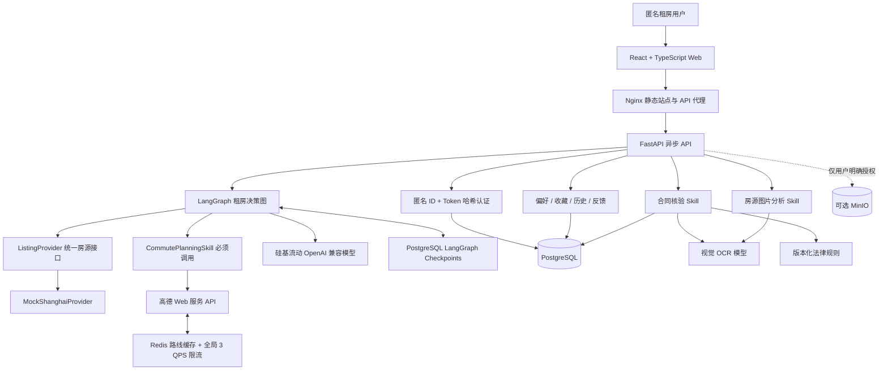
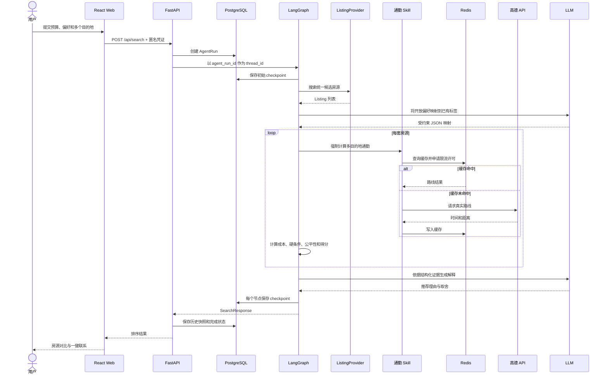
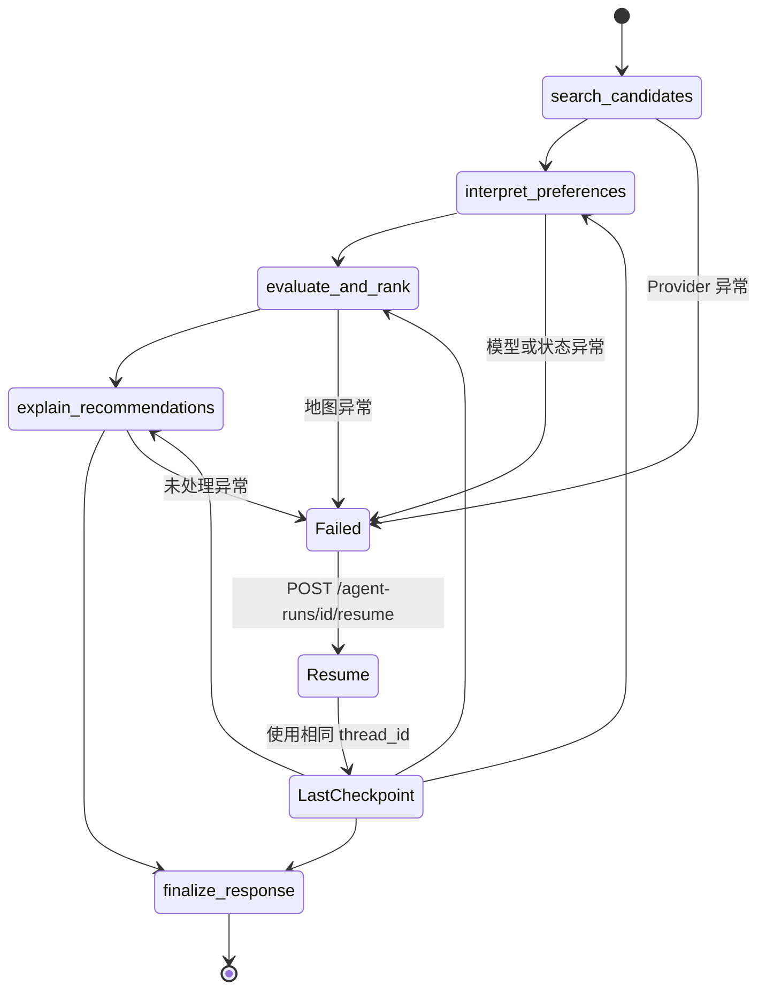
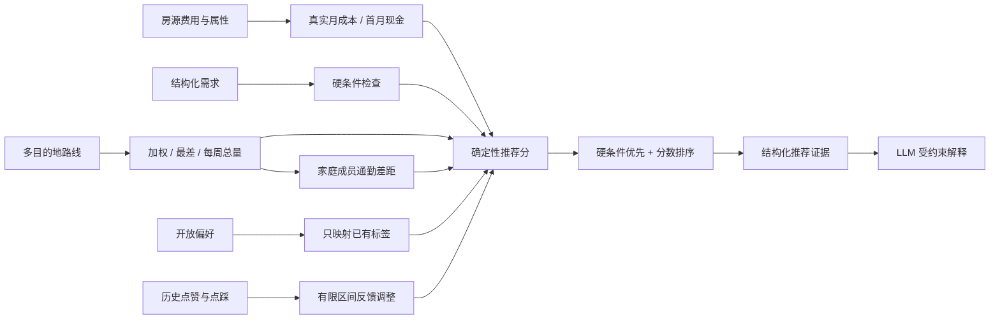
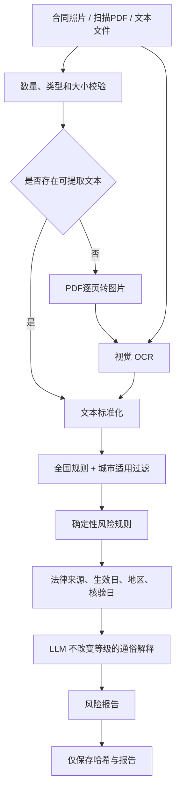
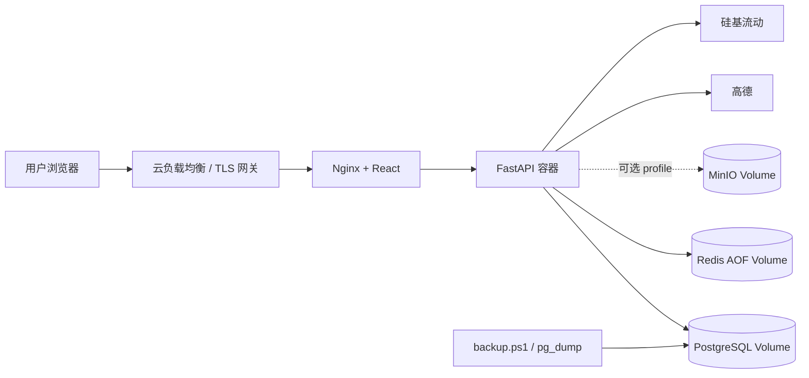

# RentWise AI 中文系统架构

## 1. 架构目标

系统采用“确定性决策内核 + Agent 流程编排 + 受约束 LLM”的结构：费用、通勤、硬条件和风险等级由代码或规则计算；LLM只处理开放语言和解释；所有关键结果都能回溯到输入快照和外部证据。

## 2. 总体架构

## 3. 分层说明

| 层级 | 组件 | 职责 |
|---|---|---|
| 交互层 | React、TypeScript | 需求向导、结果对比、历史、收藏、合同与图片上传、中英文切换 |
| 接口层 | Nginx、FastAPI | API代理、匿名认证、参数校验、错误边界、安全响应头 |
| Agent层 | LangGraph | 五阶段决策编排、节点轨迹、checkpoint 和恢复 |
| Skill层 | 通勤、合同、图片 Skill | 封装必须执行或高风险的能力边界 |
| Provider层 | ListingProvider、MapProvider、LLM | 隔离房源、地图和模型供应商实现 |
| 状态层 | PostgreSQL、Redis、MinIO | 事实数据、缓存限流、可选授权文件存储 |
| 工程层 | Docker Compose、Alembic、Pytest、Playwright | 部署、迁移、测试、评估和运维 |

## 4. 租房搜索时序

## 5. LangGraph 状态图

LLM解释失败通常会走确定性降级模板；高德失败不会用随机时间替代，而是显式返回服务不可用并保留 checkpoint。

## 6. 评分数据流

## 7. 合同核验架构

## 8. 数据存储边界

| 存储 | 保存内容 | 不保存内容 |
|---|---|---|
| PostgreSQL | 匿名 Token 哈希、偏好、收藏快照、搜索历史、反馈、AgentRun、checkpoint、合同报告 | 明文 Token、合同正文和原图 |
| Redis | 高德地理编码与路线缓存、全局限流状态 | 用户长期档案和关键业务事实 |
| 浏览器 localStorage | 匿名 ID、匿名访问 Token | 合同文件和完整服务端历史 |
| MinIO | 仅在启用且用户明确授权时保存的文件 | 默认不保存任何上传原件 |

## 9. 部署架构

生产覆盖配置为后端和前端启用只读文件系统、健康检查、资源限制和自动重启。TLS由入口网关处理，数据库、Redis和MinIO端口不应暴露公网。

## 10. 当前边界与扩展点

- 当前 ListingProvider 是模拟上海数据；真实中国房源数据源是主要剩余业务集成。
- `ListingProvider` 和 `MapProvider` 保持统一接口，新增 Provider 不需要重写 Agent 主流程。
- 法律规则目前覆盖全国基础规则和上海地方规则；其他城市会显示明确缺口提示。
- checkpoint 需要在生产环境配置保留期、清理和归档策略。

