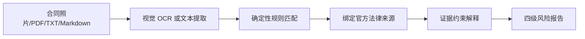

# 租赁合同核验 Skill

`RentalContractReviewSkill` 是独立于租房搜索 LangGraph 的高风险能力模块。

## 流程

LLM不能修改风险等级、添加不存在的法条或作出最终违法/无效认定。模型失败时仍返回规则报告。

## 当前规则

- 非居住空间单独出租用于居住。
- 文本明确显示缺少规划许可或属于违法建筑。
- 所有维修责任无区分转移给承租人。
- 出租人无需通知即可随时进入房屋。
- 押金无条件不退。
- 上海住房租赁合同一般事项缺失。

## 官方来源

- [住房租赁条例，国务院令第812号](https://xzfg.moj.gov.cn/mobile/law/detail?LawID=1774&Query=)
- [中华人民共和国民法典第712—714条](https://gdca.miit.gov.cn/zwgk/zcwj/flfg/art/2020/art_573d6ef5018b46b6a4e1f31ca085a710.html)
- [上海市住房租赁条例](https://fgj.sh.gov.cn/gzdt/20221202/f72b607956b34fc4878d55b5a6a9d064.html)
- [最高人民法院城镇房屋租赁合同司法解释](https://gongbao.court.gov.cn/Details/1ba2a85c913753569685966e8ee1e6.html)

## 限制

- 只做关键词和规则触发，不能替代完整法律分析。
- 支持最多12张 JPG/PNG/WebP 照片，按每2页一批进行视觉 OCR。
- 全国规则始终适用；上海地方规则只对上海报告启用。其他城市会明确提示当地规则尚未加载，避免误用上海依据。
- 照片应清晰、端正、无反光；OCR截断或无法识别时报告会显示警告。
- 扫描版 PDF 当前不会自动转图片，应以页面照片上传。
- 不能核验权属证书、规划许可或真实履约事实。
- 规则未触发不代表合同安全。
- 输出不替代律师意见或司法机关认定。
