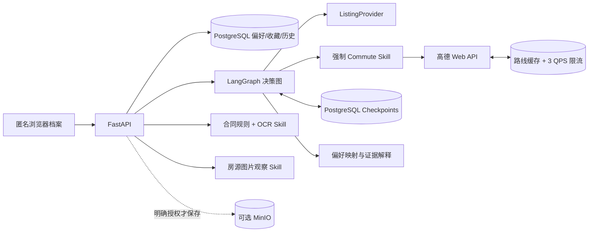
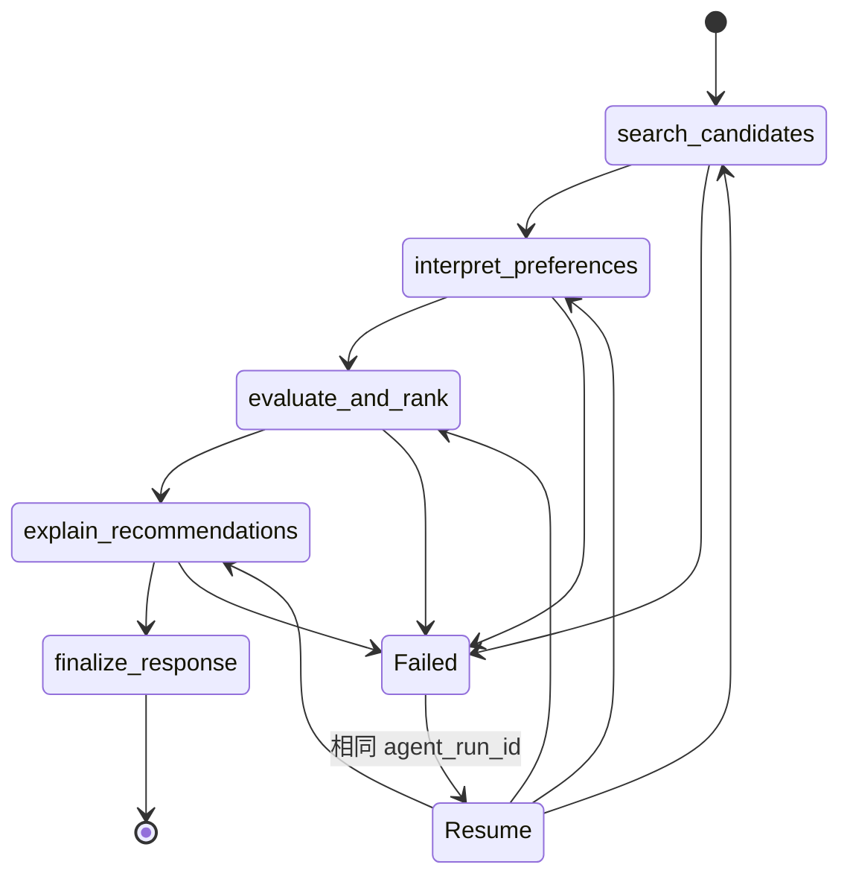

# 数据流与 Agent 流程

```mermaid
flowchart LR
  Browser["匿名浏览器档案"] --> API["FastAPI"]
  API --> Profile[("PostgreSQL 偏好/收藏/历史")]
  API --> Graph["LangGraph 决策图"]
  Graph --> Listings["ListingProvider"]
  Graph --> Commute["强制 Commute Skill"]
  Commute --> AMap["高德 Web API"]
  AMap <--> Redis[("路线缓存 + 3 QPS 限流")]
  Graph <--> Checkpoint[("PostgreSQL Checkpoints")]
  Graph --> LLM["偏好映射与证据解释"]
  API --> Contract["合同规则 + OCR Skill"]
  API --> Vision["房源图片观察 Skill"]
  API -. "明确授权才保存" .-> MinIO[("可选 MinIO")]
```

```mermaid
stateDiagram-v2
  [*] --> search_candidates
  search_candidates --> interpret_preferences
  interpret_preferences --> evaluate_and_rank
  evaluate_and_rank --> explain_recommendations
  explain_recommendations --> finalize_response
  finalize_response --> [*]
  search_candidates --> Failed
  interpret_preferences --> Failed
  evaluate_and_rank --> Failed
  explain_recommendations --> Failed
  Failed --> Resume: 相同 agent_run_id
  Resume --> search_candidates
  Resume --> interpret_preferences
  Resume --> evaluate_and_rank
  Resume --> explain_recommendations
```

成本、通勤、硬约束和最终分数由确定性代码计算。LLM 只能映射到已有标签、重述证据或分析图片可见现象，不能修改路线数字、法律等级或房源真实性。
